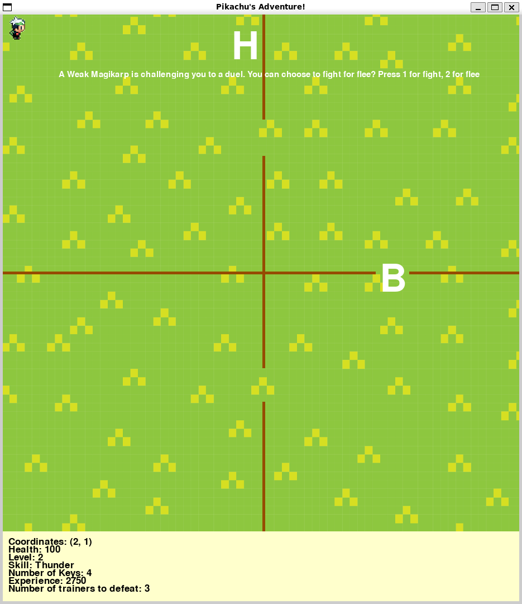

# Welcome to Pikachu's Adventure

## Creators:

Ian Chan | **A00910012** | beingaturtle 

Edro Gonzales | **A01257468** | Nog-bs

## Useful Links

Figma: [Pikachu's Adventure on Figma](https://www.figma.com/file/VlCe4eIoylEsFdCJ6FpZ5H/1510%3A-Pikachu's-Adventure?type=whiteboard&node-id=0%3A1&t=5DEfG8wT9XRF36HS-1)

Github: [Pikachu's Adventure on Github](https://github.com/beingaturtle/pikachus_adventure)

# Game Guide

## Getting Started

1. Clone the project repository using `git clone`.

2. Start the game with the command `python3 game.py`.

3. Enter a username consisting of letters, digits, hyphens, or underscores.

4. Embark on your adventure, exploring the game world and engaging with various elements.

## Controls

- Move your character using WASD keys or arrow buttons on your keyboard.

## Key Locations

### Hospital

- Find hospitals in the game to heal your Pikachu and save your progress.

- Hospitals serve as save points, recording your character's stats. If your health drops to zero during a battle, the game will indicate your loss and close. Upon re-entering with the same username, your character's last saved state will be loaded.

### Trainers

- Look for trainers marked with a "B" symbolizing bosses blocking each gate. Defeat these trainers before advancing through each gate.

- To challenge a boss, you need a specific number of keys:
  - First Gate = 3 Keys
  - Second Gate = 6 Keys
  - Third Gate = 9 Keys

- *To challenge the final boss, you need a total of 12 keys*

- Acquire keys by battling wild Pokemon; battling them is encouraged.

### Completing the Game

- To complete the game, level up your character sufficiently to challenge the final boss

- The final boss is formidable, but you can do it! Rumor has it that the last boss sports a magnificent beard :)

### Reflection

This game was developed in one week, and while Ian and I wish we had more time to create a more extensive game, we enjoyed the process. We gained valuable experience in unit testing and Pythonic programming along the way.

